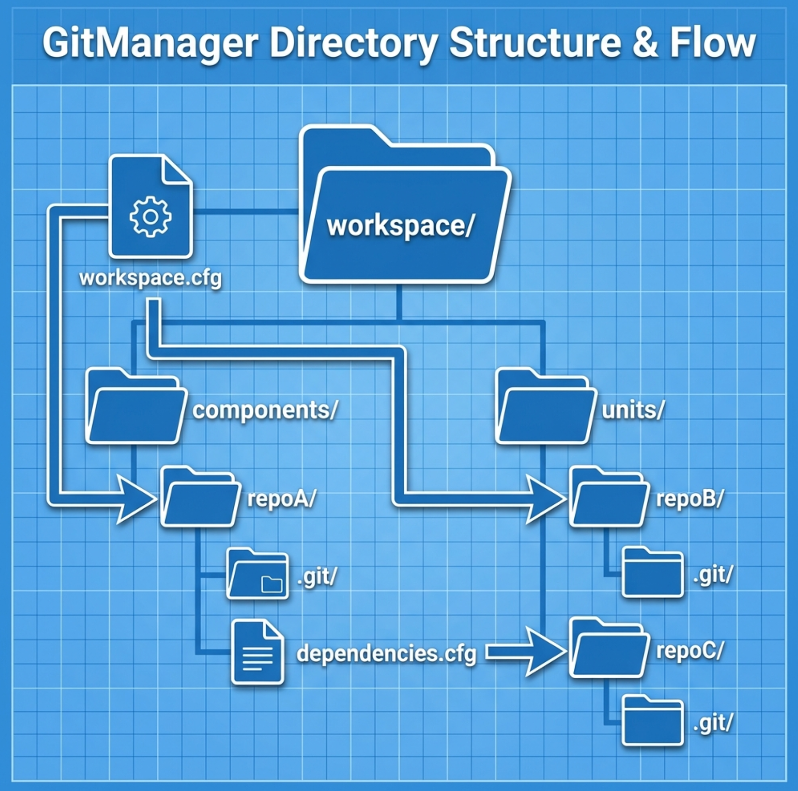

# GitManager

**GitManager** is a lightweight CLI tool designed to manage multi-repository workspaces. It automates the cloning of repositories defined in a configuration file and handles recursive dependencies.



**Note**: This tool is currently in development and may have limitations or bugs. Use with caution.

## Features

- **Workspace Management**: Clones multiple repositories defined in a `workspace.cfg` file.
- **Recursive Dependencies**: Automatically detects and processes `dependencies.cfg` files within cloned repositories.
- **Conflict Detection**: Ensures that multiple configurations do not attempt to clone different repositories into the same path.
- **Report Generation**: Produces a `dependencies.txt` file listing all cloned repositories and their paths.
- **Lightweight**: Written in C for speed and portability, with no external runtime dependencies beyond Git.

## Installation
### Option 1: Download Binaries
Download the pre-compiled executable for your OS from the [Releases Page](https://github.com/HariSeldon86/gitmanager/releases).

### Option 2: Manual Compilation
1. Compile the source code (e.g. for Windows):
   ```bash
   gcc gitmanager.c -o gitmanager.exe
   ```
2. Move `gitmanager.exe` to a directory in your system PATH (e.g., `C:\Users\YourUser\bin`).

## Usage

GitManager includes a built-in help system. Run the tool to see available commands:

```bash
gitmanager help
```

### Commands
`clone`: Parses `workspace.cfg` and clones all listed repositories.

`help`: Displays usage instructions and configuration syntax.

### Configuration Format

Create a `workspace.cfg` (or `dependencies.cfg` in sub-repos) with the following syntax:

```ini,TOML
REPO "https://github.com/user/repo.git" [BRANCH "branch_name"] [PATH "./destination/path"]
```

- **REPO**: (Required) The Git repository URL.
- **BRANCH**: (Optional) The specific branch or tag to clone. Defaults to `HEAD` (default branch) if omitted.
- **PATH**: (Optional) The local destination path. Defaults to `./<repo_name>` if omitted.
- Lines starting with `#` are ignored.


### Output

After execution, a `dependencies.txt` file is generated in the root directory, providing a snapshot of the workspace state.

## Docker
GitManager is also on [DockerHub](https://hub.docker.com/repository/docker/rennales/gitmanager/general).

For an interactive shell with gitmanager and git pre-installed:

```Bash
docker run -it --rm -v ${PWD}:/workspace rennales/gitmanager:latest
```

Once inside, you can manually run `gitmanager clone` or standard `git` commands.

## Requirements
* Git: Must be installed in the environment (included in the Docker image).

* Config: A `workspace.cfg` must exist in the execution directory.